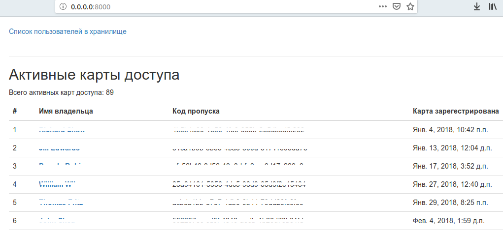

# Пульт охраны банка

Это внутренний репозиторий для сотрудников банка «Сияние». Если вы попали в этот репозиторий случайно, то вы не сможете его запустить, т.к. у вас нет доступа к БД, но можете свободно использовать код вёрстки или посмотреть как реализованы запросы к БД.

Пульт охраны — это сайт, который можно подключить к удалённой базе данных с визитами и карточками пропуска сотрудников нашего банка.

### Как установить и запустить

Запросите доступ к БД у менеджера вашего банка. Для доступа вам понадобятся хост, порт,название базы данных,имя пользователя базы данных и пароль,
секретный ключ

В каталоге с программой необходимо создать файл .env со значениями переменных

BASE_HOST= IP-адрес
BASE_PORT= порт 
BASE_NAME='название базы данных'
BASE_USER='имя пользователя базы'
BASE_USER_PASSWORD='пароль пользователя базы'
SECRET_KEY ='секретный ключ'
DJANGO_DEBUG = True


* или DJANGO_DEBUG = False,в зависимости от задач

Python3 должен быть уже установлен. 
Затем используйте `pip` (или `pip3`, есть конфликт с Python2) для установки зависимостей:
```
pip install -r requirements.txt
```
и
```
$python3 manage.py runserver 0.0.0.0:8000 
```
далее , в браузере перейти по данному адресу (0.0.0.0:8000 )



### Цель проекта

Код написан в образовательных целях на онлайн-курсе для веб-разработчиков [dvmn.org](https://dvmn.org/).